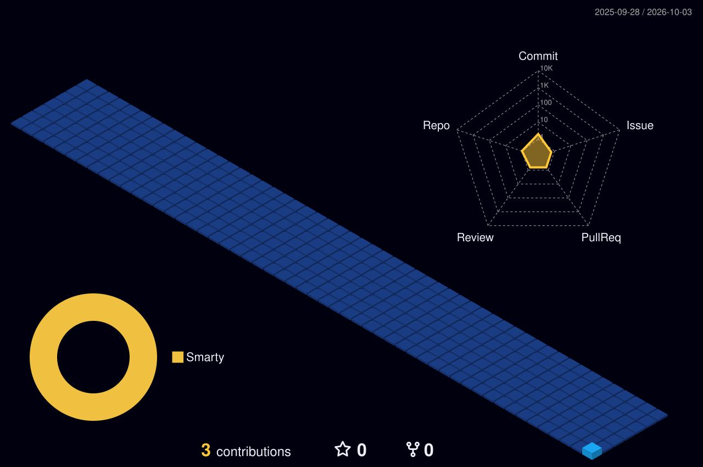

 

  

  

  

  

## Profile

SOC and Red Team Lead based in Lahore, Pakistan. I work across detection engineering, incident response, vulnerability management, and adversary simulation, building practical workflows with SIEM, EDR/XDR, SOAR, and automation.

## Areas of impact

- **SOC engineering:** Built workflows integrating SIEM, EDR/XDR, SOAR automation, and AI-assisted analysis.
- **Vulnerability assessment:** Developed tooling for vulnerability analysis, attack correlation, investigations, and customer reporting.
- **Red and purple team:** Conducted web security assessments and adversary simulations, then used findings to improve detection and response.
- **Threat hunting:** Deployed honeypots and analyzed suspicious network activity in SOC and lab environments.
- **Infrastructure security:** Supported mail security, risk assessments, server hardening, patching, and compliance.
- **Analyst mentoring:** Teach practical log analysis, malware labs, incident response, and network defense.

## Experience

### Current roles

- **Secure Quanta** — SOC and Red Team Lead, remote · May 2024–Present
- **Cyberwing** — Cyber Security Specialist and Analyst · Jan 2023–Present

### Previous roles

- **Binary Cubers** — Security Specialist, remote contract · Sep 2023–Mar 2024
- **Prodigy Infotech** — Cyber Security Remote Intern · Mar–Apr 2024
- **Corvit Networks LLC** — Junior Cyber Security Analyst Intern · Mar–Sep 2023

## Technical focus

- **SOC and detection:** Splunk, Wazuh, QRadar, Xcitium XDR, SentinelOne, SOAR, incident response, threat hunting, honeypots, Suricata, and Snort.
- **Red and purple team:** Nessus, Qualys, Nexpose, OpenVAS, Nuclei, web exploitation, adversary simulation, MITRE ATT&CK, and security automation.
- **Cloud and infrastructure:** AWS, Azure, CloudWatch, CloudTrail, CloudGuard, IAM, pfSense, OpenVPN, Windows, Windows Server, Linux, Red Hat, and Debian.
- **Scripting and governance:** Python, Bash, PowerShell, NIST CSF, SOC 2, ISO 27001, CIS Benchmarks, audits, and risk assessments.

## Certifications and training

**Cyberwarfare Labs:** CRTA · CRT-ID · CRT-COI · MCBTA  
**ISC2:** Certified in Cybersecurity (CC)  
**Microsoft:** SC-900 · AZ-900 · SC-200 · MS-900  
**Course certificates:** Google Foundations of Cybersecurity · Play It Safe: Manage Security Risks · Connect and Protect: Networks and Network Security · CrowdSec Community-Driven Cybersecurity  
**Additional training:** NAVTAC Cybersecurity and Digital Forensics · Cyberwing Cybersecurity and SOC Operations · CCNA training · CCNP training

[Credential records on LinkedIn](https://www.linkedin.com/in/omar-mahmood12/)

## Education

**Virtual University, Lahore** — BS, Information Technology  
**Indian School Ibri, Oman** — Intermediate, Science · completed March 2019

## Public profiles and labs

- [GitHub repositories](https://github.com/oxploited19?tab=repositories)
- [TryHackMe labs and write-ups](https://tryhackme.com/p/Oxploited19)

 

**Adversary minded. Defender focused.**

